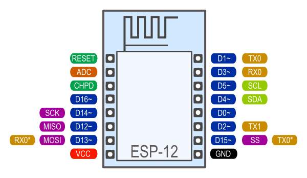

# ESP8266 Blink e porta seriale

Sul web c'è parecchia confusione sull'utilizzo della porta seriale e del led incluso nei moduli ESP-12 ed ESP-01.

In molti articoli viene scritto che non è possibile utilizzare il led buil-in insieme alla porta seriale. Questa affermazione è solo parzialmente corretta.

Il led "built-in" è collegato solitamente al GPIO 2 (D2) che è utilizzato anche come TX delle porta seriale 1.  Ho scritto solitamente perchè nei forum ci sono utenti che segnalano di avere dei moduli ESP-12 con led collegato ad un GPIO diverso dal 2. Produttori diversi potrebbero aver collegato il led ad un diverso PIN.

Un LED può essere collegato ad un pin digitale come "source" (pin fornisce corrente) o come "sink" (pin assorbe corrente). In entrabi i casi è presente un resistenza in serie.  Il led built-in dei moduli ESP-12 è collegato in modalità sink.

Questo circuito ha tre conseguenze:

1. Il LED funziona con logica invertita: pin in stato HIGH => led spento e pin in stato LOW => led acceso
2. il led built-in non può essere utilizzato contemporaneamente alla porta seriale 1
3. è necessario considerare le presenza del led e della resistenza quando si utilizza il pin D2 (e la porta seriale 1)

Utilizzando le librerie ESP8266 Arduino Core l'oggetto "Serial" è mappato [(vedi documentazione arduino esp8266)](https://arduino-esp8266.readthedocs.io/en/latest/reference.html#serial) sulla porta seriale 0 e quindi non ci sono controindicazioni ad usare il log seriali ed il led su GPIO2 come dimostra l'esempio [BlinK senza Delay](../ESP8266\Blink-without-delay)

> `Serial` uses UART0, which is mapped to pins GPIO1 (TX) and GPIO3 (RX). Serial may be remapped to GPIO15 (TX) and GPIO13 (RX) by calling `Serial.swap()` after `Serial.begin`. Calling `swap` again maps UART0 back to GPIO1 and GPIO3.

