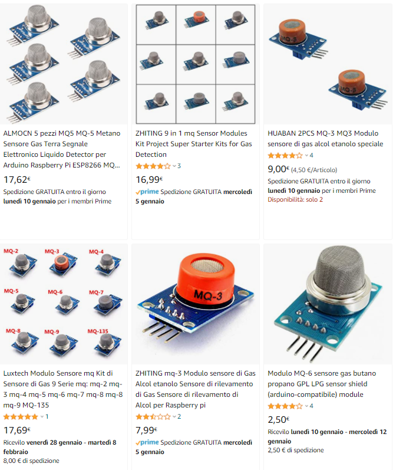
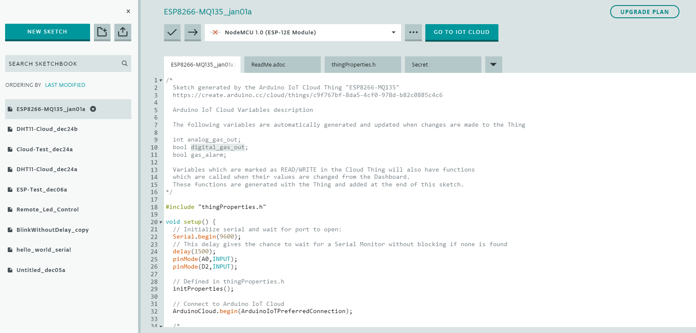
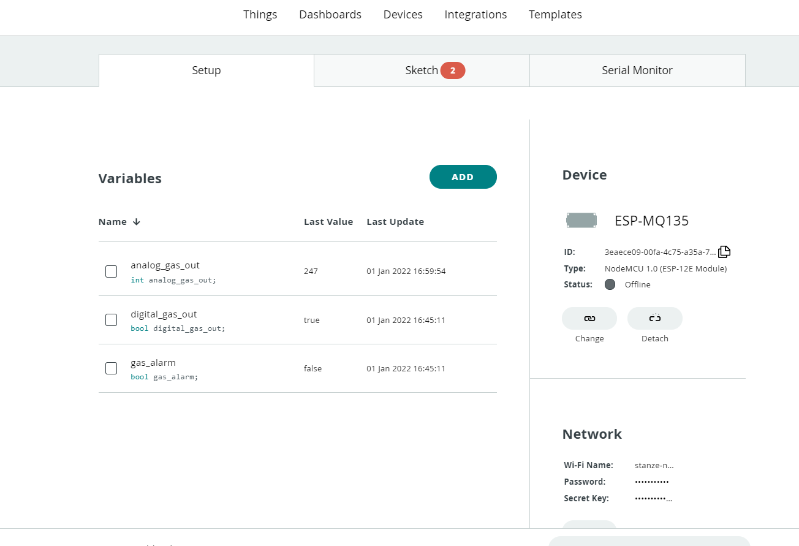
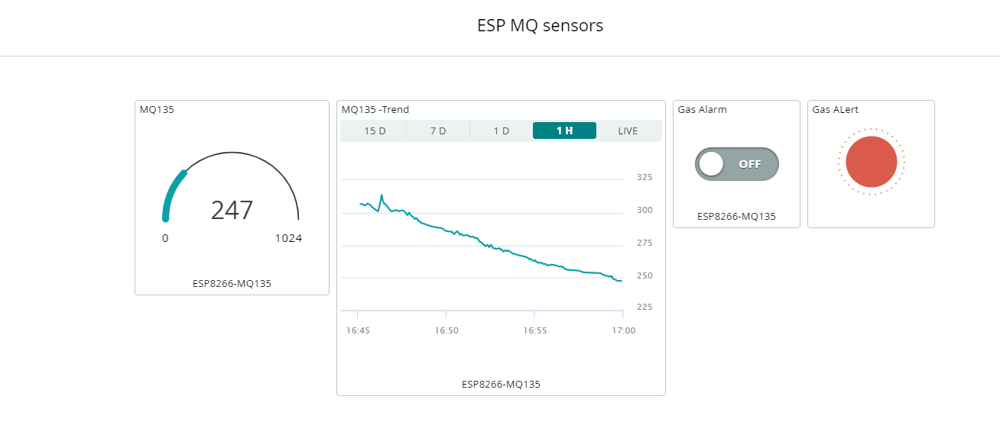

# Monitoraggio qualità dell'aria e rilevamento gas con Sensori serie MQ

La rilevazione della presenza di determinati gas e la misurazione delle loro concentrazione ha molte applicazioni che riguardano ad esempio la sicurezza (in ambiente domestico e sui luoghi di lavoro) e il monitoraggio della qualità dell'aria.

Ad esempio la concentrazione di CO2 nell'aria che circola all’interno dei locali, è legata al numero di persone che abitualmente, occupano un determinato edificio e alle possibilità di ricambio dell'aria. La percentuale di CO2 misurata negli ambienti interni, è uno dei parametri fondamentali, ai fini della regolazione della ventilazione. I limiti regolamentari e normativi vigenti in vari paesi variano tra i 1000 e 1500 ppm (parti per milione). Con la pandemia Covid-19 il monitoraggio del ricambio dell'aria è diventato un tema ancora più rilevante.

## I sensori MQ

I sensori della serie MQ sono molto economici (2-3€), facili da usare e permettono di misurare le concentrazioni di diversi tipi di gas. Grazie alla combinazione di facilità d'uso e  costo molto contenuto, questi sensori sono molto usati dai makers, ma anche da ricercatori in ambito accademico.

- MQ-2 - Methane, Butane, LPG, smoke
- MQ-3 - Alcohol, Ethanol, smoke
- MQ-4 - Methane, CNG Gas
- MQ-5 - Natural gas, LPG
- MQ-6 - LPG, butane gas
- MQ-7 - Carbon Monoxide
- MQ-8 - Hydrogen Gas
- MQ-9 - Carbon Monoxide, flammable gasses
- MQ131 - Ozone
- MQ135 - Air Quality (CO, Ammonia, Benzene, Alcohol, smoke)
- MQ136 - Hydrogen Sulfide gas
- MQ137 - Ammonia
- MQ138 - Benzene, Toluene, Alcohol, Acetone, Propane, Formaldehyde gas, Hydrogen
- MQ214 - Methane, Natural gas

Cercate MQ Gas Sensors su un motore di ricerca e li troverete senza difficoltà ....



Sul web si trovano numerosi progetti ed esempi. **L'utilizzo di questi sensori per delle misurazioni accurate richiede però di eseguire una calibrazione del sistema di misura che non è banale ed non rientra nello scopo di questo corso.**  In altre parole i progetti che realizzeremo vanno bene come esperimenti didattici, ma non per realizzare sistemi di sicurezza da cui dipende l'incolumità di cose e persone.

### Utilizzo con ESP8266 in ambiente Arduino Core

L'utilizzo di base di questi sensori è banale: sono sufficienti 10 righe di codice e circa 30 righe di codice. Per un utilizzo di base è sufficiente collegare l'uscita analogica e l'uscita digitale del sensore ad un ingresso analogico ed un ingresso digitale e poi leggere periodicamente il valore.

In ambiente Arduino il tutto il codice si riduce a questo:

```c++
int analog_gas_out;
bool digital_gas_out;

void setup() {

 Serial.begin(9600);

 // This delay gives the chance to wait for a Serial Monitor without blocking if none is found

 delay(1500);

 pinMode(A0,INPUT); //uscita analogica del sensore collegata ad ingresso A0 della scheda di sviluppo

 pinMode(D2,INPUT); //uscita digitale del sensore collegata ad ingresso D2 della scheda di sviluppo

}


void loop() {

 analog_gas_out =analogRead(A0);

 digital_gas_out=digitalRead(D2);

 Serial.print("analog_gas_out analog read value: ");

 Serial.println(analog_gas_out);

 Serial.print("digital_gas_out: ");

 Serial.println(digital_gas_out);

 delay(100);

}
```

## Realizziamo un sistema di monitoraggio della qualità dell'aria con dashboard in cloud in 10 minuti con 8€ di spesa

Nella cartella condivisa del corso trovate il video con tutta la configurazione della componente di campo e della componente cloud dell'applicazione. Anche in questo caso ho utilizzato la piattaforma Arduino IoT cloud.

Il sorgente del progetto di esempio da cui partire per realizzare le vostre applicazioni è invece sul repository del corso: [CorsoApplicazioni_IoT/ESP8266/ESP8266-MQ at main · emanbuc/CorsoApplicazioni_IoT (github.com)](https://github.com/emanbuc/CorsoApplicazioni_IoT/tree/main/ESP8266/ESP8266-MQ)







```c++

```

## Altri esempi di progetti con i sensori MQ

- <https://diyi0t.com/mq2-gas-sensor-arduino-esp8266-esp32/>
- [Measure CO2 with MQ-135 and Arduino Uno - Rob's blog (robberg.net)](https://blog.robberg.net/mq-135-arduino/)
- [Capable of Gas Sensor MQ-135 to Monitor the Air Quality with Arduino uno](http://www.irphouse.com/ijert20/ijertv13n10_52.pdf)
- [Early Detection of Leaks on Gas Cylinders Using Arduino Based MQ-6 Sensors](https://iopscience.iop.org/article/10.1088/1742-6596/1413/1/012030/pdf)
- 

## Materiale per approfondire

L'utilizzo di base dei seonsori MQ è molto semplice, ma eseguire delle misure precise ed affidabili e un problema molto più complesso.
In questo paragrafo troverete dei link a materiale utile ad approfondire, ma che può essere però essere tranquillamente ignorato per realizzare i progetti del corso.

- Per la calibrazione vedi ad esempio: [Measuring CO2 with MQ135 – Pocket Science Lab (pslab.io)](https://pslab.io/blog/measuring-co2-with-mq135/)
- Una analisi rigorosa del funzionamento di questi sensori viene fatta in  [CO2-sensing properties and mechanism of nano-SnO2 thick-film sensor - ScienceDirect](https://www.sciencedirect.com/science/article/pii/S0925400515307474?via%3Dihub)
- Un altro studio relativo però al rilevamento del monossido di carbonio: [Ambient Humidity Influence on CO Detection with SnO2 Gas Sensing Materials. A Combined DRIFTS/DFT Investigation | The Journal of Physical Chemistry C (acs.org)](https://pubs.acs.org/doi/10.1021/acs.jpcc.7b06253)
- Sensore [TGS2602](https://www.figarosensor.com/product/docs/TGS2602-B00%20%280615%29.pdf)
- Utilizzo dei sensori MQ per il [riconoscimento degli odori](http://www.jait.us/index.php?m=content&c=index&a=show&catid=205&id=1135) 
- [MQ 135 sensors on Component101](https://components101.com/sensors/mq135-gas-sensor-for-air-quality)
- [Low Cost IoT Based Air Quality Monitoring Setup Using Arduino and MQ Series Sensors With Dataset Analysis](https://www.sciencedirect.com/science/article/pii/S187705092030051X?via%3Dihub)
