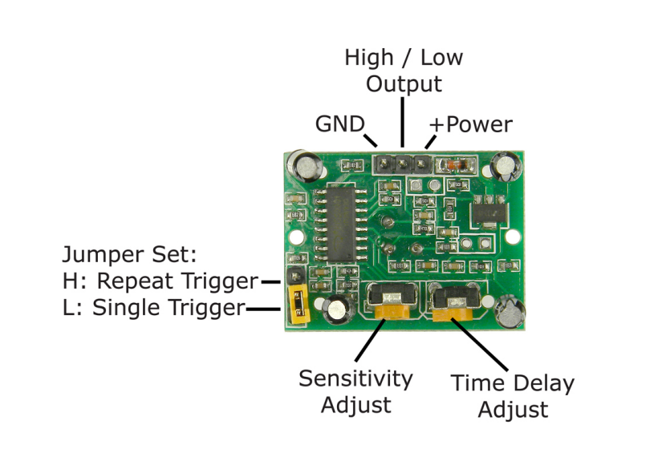

# ESP8266 Motion Detection With PIR

## PIR HC-RS501

The output of the HC-SR501 PIR Motion Sensor is:

- HIGH (3.3V) when a movement is detected.
- LOW (0V) when no movement is detected.
  
If you start the motion sensor, you must wait for 60 seconds for an initial stabilization time to get accurate measurements. We will consider this initial stabilization time in the setup function of our Arduino program code.

The HC-SR501 has in total 3 adjustment options:

1. Single trigger (Low) where several consecutive triggers are recognized as one trigger or repeating trigger (High) where every detected trigger is computed.
2. Delay time that defines how long the output of the HC-SR501 stays HIGH after a motion is detected between 2.5 seconds and 5 minutes.
Measuring distance between 3 meters and 7 meters.

3. The measuring angle of the HC-SR501 is 110° to be able to record movements in a wide angle in front of the sensor.

- If the trigger selection jumper is repeating trigger (H), you see that the second spike from the motion detected signal is recognized and increases the time that the digital output stays HIGH.

- If the trigger selection jumper is single trigger (L), only the initial spike of the motion detected signal is considered and therefore, the time that the HC-SR501 PIR motion sensor stays HIGH is lower compared to the hold jumper selection

## Wiring

source: [https://diyi0t.com/hc-sr501-pir-motion-sensor-arduino-esp8266-esp32/](https://diyi0t.com/hc-sr501-pir-motion-sensor-arduino-esp8266-esp32/)