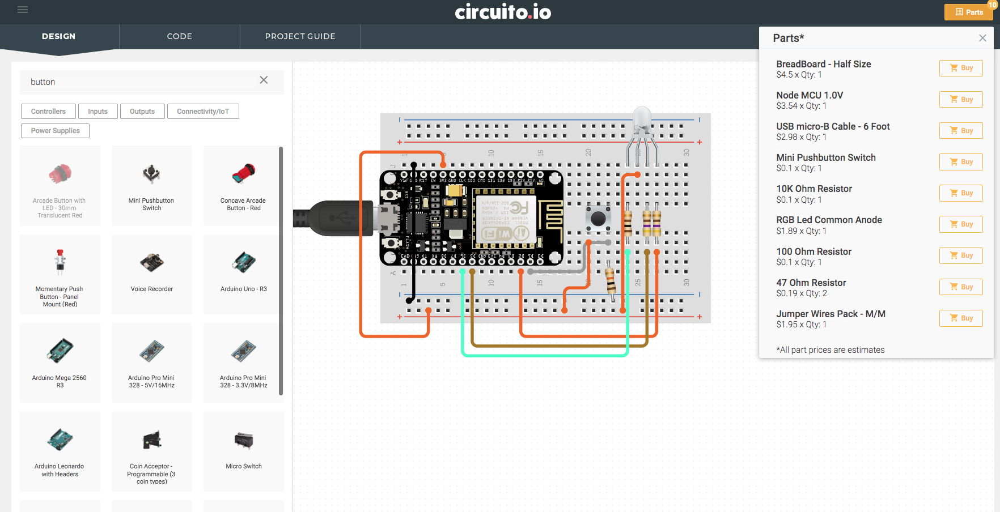

## Cos'è un breadboard?

Una breadboard è un dispositivo semplice progettato per consentire di creare circuiti senza necessità di saldatura. Sono disponibili in varie dimensioni e l'aspetto può variare, ma alla fine sono tutte simili. Un modello comune è questo:

Per capire come funziona è utile guardare come è fatta da sotto.

 **Nota:  Non fatelo con quelle del kit fornito per il corso perché poi la copertura non si re-incolla bene.**

I due pezzi più grandi di metallo sono solitamente usati per collegare una fonte di energia alla scheda. (**binari di alimentazione**) . Gli altri pezzi di conduttore metallico perpendicolari sono usati per collegare tra loro i **componenti** nel circuito.

Le parti in metallo sono realizzate come molle che devono andare a stringere i terminali dei componenti elettronici infilati nella board. Se ne vede uno smontato in questa immagine

 

 Nell'immagine qui sotto sono invece evidenziate le connessioni.

Circuiti Integrati in Package DIP

Lo spazio al centro (se presente) è progettato per ospitare componenti elettronici nel formato Dual Inline Package (DIP) ed in la spaziatura dei fori sulle breadboard corrisponde al passo standard del componenti DIP.

Esempi di circuito realizzato su breadboard:

## Progetti di Bread Board

Uno strumento utile per progettare e documentare i prototipi realizzati su breadboard è [Fritzing](http://fritzing.org/home/). Il progetto è rimasto open source, ma recentemente per scaricare l'applicazione già compilata e pronta per l'installazione è necessario pagare un contributo di 8$. 

Si tratta di uno strumento di progettazione CAD per circuiti elettronici specializzato per i progetti realizzati su breadboard.

Un altro strumento molto utile è [Circuito](https://www.circuito.io/app?components=513,360216). Si tratta di una applicazione online che aiuta a realizzare i propri progetti su breadboard. *Ricca di funzionalità e gratuita*.

