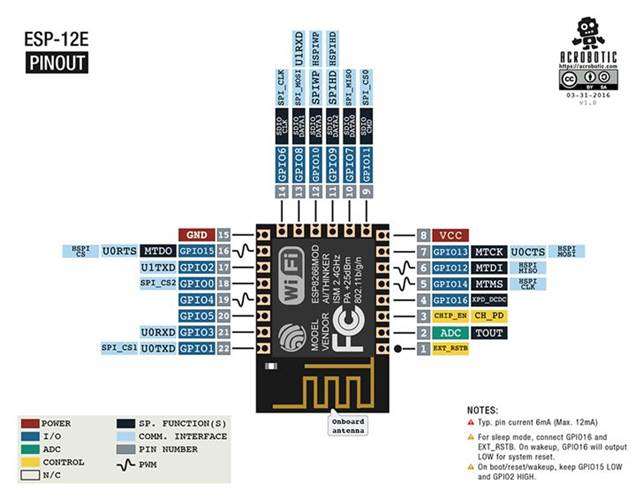
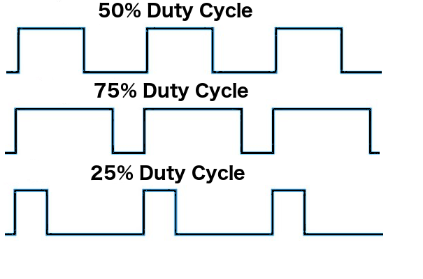

# Connettere ESP8266

I moduli ESP8266 sono dotati di numerose connessioni che possono essere utilizzate come input o come output. Troviamo più o meno le stessa dotazione delle board Arduino o di altri microcontrollori:

- Ingressi ed uscite digitali (GPIO)
- I2C
- SPI
- UART
- Ingresso analogico

La caratteristica peculiare di ESP8266 è la presenza del WiFi integrato all’interno del microcontrollore!

## Digital pins

The digital pins on the Arduino are the ones that are used the most when connecting external sensors. These pins can be configured for either input or output. These pins default to an input state; therefore, when we are using a pin for input we do not need to explicitly declare them as input pins; however, it is good practice to do so because it will make it easier for someone reading our code to understand what the pin is being used for.

The digital pins will have one of two values: HIGH (1), which is 5V, or LOW (0), which is 0V. Once we start to program the Arduino, we will see how to read from or write to these pins.

## Analog input pins

The Arduino Uno contains a built-in **Analog-To-Digital** (**ADC**) converter with six channels, which gives us six analog input pins. The ADC converts an analog signal into a digital value. While the digital pins have two values, either high or low, the analog input pins have values from 0 to 1023 relative to the reference value of the Arduino. The Arduino Uno has a reference value of 5V.

The analog input pins are used to read analog sensors such as rangefinders and temperature sensors. The six analog pins can also be configured as digital pins if we run out of digital pins in our project.

## PWM pins

Where the analog input pins are designed to read analog sensors (input), the PWM pins are designed for output. PWM is a technique for obtaining analog results with digital output.

Since a digital output can be either on or off, to obtain the analog output the digital output is switch between HIGH and LOW rapidly. The percentage of the time that the signal is high is called the **duty cycle**. The following diagram illustrates this concept:

We have the ability to set the frequency of how fast the signal can switch between HIGH and LOW. This frequency is measured in Hertz and sets how many times the signal can switch per second. For example, if we set the frequency to 500 Hz, that would mean that the signal could switch 500 times a second.

We will be using the PWM pins for several examples in this book and will examine them more when we learn how to program the Arduino.

## Power pins

The Arduino has several power pins. They are as follows:

- **VIN**: This pin is used when we     power the Arduino board using an external power supply. This is the pin     used in the *Using     the VIN/GND pins to power the Arduino* section of this     chapter.
- **GND**: These are the ground pins.
- **5V**: This is 5V out and is used to     power most sensors.
- **3.3V**: This is 3.3V out and can be     used to power sensors that are compatible with 3.3V. A list of some     compatible 3.3V sensors can be found here: https://www.dfrobot.com/wiki/index.php/3.3V_Compatible_Device_List.
- **Reset**: This pin can be used to reset     the Arduino board by an external source.
- **ioref**: This is the reference voltage     for the board. For the Arduino, this will be 5V.

## Serial pins

These pins can be used for serial communication. The RX (digital pin 0) is used to receive while TX (digital pin 1) is used to transmit. These pins are connected directly to the USB-to-TTL serial chip. One note, you should not connect these pins directly to an RS-232 serial port because you will damage your board.

## SPI pins

The **Serial Peripheral Interface** (**SPI**) pins are used for a synchronous serial data protocol that is used by microcontrollers for communicating with peripheral devices. This protocol always has one master with one or more slave devices. The pins are:

- **MISO**: The **Master in Slave out** pin     is used to send data from the slave to the master device.
- **MOSI**: The **Master out Slave in** the     pin is used to send data from the master to the slave device.
- **SCK**: The **serial clock** synchronizes     the data transmission and is generated by the master.
- **SS**: The **slave select** pin     tells the slave to go active or to go to sleep. This is used to select     which slave device should receive the transmission from the master.

Now that we have quickly looked at the pins on the Arduino Uno R3 let's look at some of the different Arduino boards.
