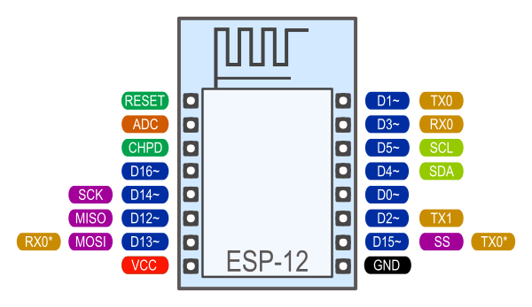

# ESP8266 Arduino Core 

https://github.com/esp8266/Arduino 

This project brings support for the ESP8266 chip to the Arduino environment. It lets you write sketches, using familiar Arduino functions and libraries, and run them directly on ESP8266, with no external microcontroller required.

ESP8266 Arduino core comes with libraries to communicate over WiFi using TCP and UDP, set up HTTP, mDNS, SSDP, and DNS servers, do OTA updates, use a file system in flash memory, and work with SD cards, servos, SPI and I2C peripherals

Utilizzando ESP8266 Arduino Core è possibile sviluppare applicazioni in C/C++ utilizzando le funzioni e le librerie dell’ecosistema Arduino. In pratica la maggior parte del software scritto per le board Arduino funzionerà senza apportare modifiche.  Lo sviluppo non è però limitato alle sole funzioni disponibili con API Arduino: è comunque sempre possibile utilizzare tutte le funzioni presenti nell’SDK del produttore (https://github.com/espressif/ESP8266_NONOS_SDK).

## PIN Mode

ESP8266 has several digital pins that we can connect external sensors and other devices to. Before we use these pins, we should configure them for either input or output depending on what we are using them for. To do this, we use the pinMode() function that is built into the Arduino programming language. Usually for smaller sketches we call the pinMode() function within the setup() function; however, this is not required. The following code shows the syntax for the pinMode() function:

```c++
pinMode(pin, mode);
```

This function is called with two parameters. The first is the number of the pin that we are setting and the second is the mode for the pin. The mode for the pin can be either INPUT, to read the value from the pin (external sensor writes a value to the pin), or OUTPUT, to set the value for the pin. The following code shows how to use this command to set the pin mode for two pins:

```c++
pinMode( 11 , INPUT);
pinMode( 12 , OUTPUT);
```

In the preceding code, we set pin 11 to input and pin 12 for output. Therefore, we would write values to pin 11 and read values from pin 12.

It is good practice never to use the pin numbers themselves, as shown in the last example, to access the pin on the Arduino. Instead of using the pin numbers like this, we should set a variable or constant with the number of the pin and then use that variable or constant when accessing the pin. This will prevent us from typing in the wrong number within the code.

My personal preference is to use #define to define the pin numbers that I am using when the pin number will not change. This allows me to separate my pin definitions from the other constants within my sketch.
 If you wish to use constants instead of #define, that is perfectly acceptable, and some people would say that it is preferable.

The following code shows how we should use the pinMode() function within a sketch:

```
#define BUTTON_ONE 12
#define LED_ONE 11
```

```
void setup() {
  pinMode(BUTTON_ONE, INPUT);
  pinMode(LED_ONE, OUTPUT);
}
```

In the preceding code, we defined constants that represented two pins. The first line defines BUTTON_ONE to the number (pin) 12 and the second line defines LED_ONE to the number (pin) 11. We then set the BUTTON_ONE pin to input mode and LED_ONE pin to output mode within the setup() function.

The pinMode() function can also be used to configure the internal pull-up resistor by setting the mode of the pin to INPUT_PULLUP. This will invert the behavior of the pin when it is in input mode.

## Digital IO

[https://arduino-esp8266.readthedocs.io/en/latest/reference.html#digital-io)](https://arduino-esp8266.readthedocs.io/en/latest/reference.html#digital-io)

Pin numbers in Arduino correspond directly to the ESP8266 GPIO pin numbers. `pinMode`, `digitalRead`, and `digitalWrite` functions work as usual, so to read GPIO2, call `digitalRead(2)`.

Digital pins 0—15 can be `INPUT`, `OUTPUT`, or `INPUT_PULLUP`. Pin 16 can be `INPUT`, `OUTPUT` or `INPUT_PULLDOWN_16`. At startup, pins are configured as `INPUT`.

Pins may also serve other functions, like Serial, I2C, SPI. These functions are normally activated by the corresponding library. The diagram below shows pin mapping for the popular ESP-12 module.



## Timing and delays

[(https://arduino-esp8266.readthedocs.io/en/latest/reference.html#timing-and-delays)](https://arduino-esp8266.readthedocs.io/en/latest/reference.html#timing-and-delays)

`millis()` and `micros()` return the number of milliseconds and microseconds elapsed after reset, respectively.

`delay(ms)` pauses the sketch for a given number of milliseconds and allows WiFi and TCP/IP tasks to run. `delayMicroseconds(us)` pauses for a given number of microseconds.

Remember that there is a lot of code that needs to run on the chip besides the sketch when WiFi is connected. WiFi and TCP/IP libraries get a chance to handle any pending events each time the `loop()` function completes, OR when `delay` is called. If you have a loop somewhere in your sketch that takes a lot of time (>50ms) without calling `delay`, you might consider adding a call to `delay` function to keep the WiFi stack running smoothly.

There is also a `yield()` function which is equivalent to `delay(0)`. The `delayMicroseconds` function, on the other hand, does not yield to other tasks, so using it for delays more than 20 milliseconds is not recommended.

## Serial

The `Serial` object works much the same way as on a regular Arduino. Apart from the hardware FIFO (128 bytes for TX and RX), `Serial` has an additional customizable 256-byte RX buffer. The size of this software buffer can be changed by the user. It is suggested to use a bigger size at higher receive speeds.

The `::setRxBufferSize(size_t size)` method changes the RX buffer size as needed. This should be called before `::begin()`. The size argument should be at least large enough to hold all data received before reading.

For transmit-only operation, the 256-byte RX buffer can be switched off to save RAM by passing mode SERIAL_TX_ONLY to Serial.begin(). Other modes are SERIAL_RX_ONLY and SERIAL_FULL (the default).

Receive is interrupt-driven, but transmit polls and busy-waits. Blocking behavior is as follows: The `::write()` call does not block if the number of bytes fits in the current space available in the TX FIFO. The call blocks if the TX FIFO is full and waits until there is room before writing more bytes into it, until all bytes are written. In other words, when the call returns, all bytes have been written to the TX FIFO, but that doesn’t mean that all bytes have been sent out through the serial line yet. The `::read()` call doesn’t block, not even if there are no bytes available for reading. The `::readBytes()` call blocks until the number of bytes read complies with the number of bytes required by the argument passed in. The `::flush()` call blocks waiting for the TX FIFO to be empty before returning. It is recommended to call this to make sure all bytes have been sent before doing configuration changes on the serial port (e.g. changing baudrate) or doing a board reset.

`Serial` uses UART0, which is mapped to pins GPIO1 (TX) and GPIO3 (RX). Serial may be remapped to GPIO15 (TX) and GPIO13 (RX) by calling `Serial.swap()` after `Serial.begin`. Calling `swap` again maps UART0 back to GPIO1 and GPIO3.

`Serial1` uses UART1, TX pin is GPIO2. UART1 can not be used to receive data because normally it’s RX pin is occupied for flash chip connection. To use `Serial1`, call `Serial1.begin(baudrate)`.

If `Serial1` is not used and `Serial` is not swapped - TX for UART0 can be mapped to GPIO2 instead by calling `Serial.set_tx(2)` after `Serial.begin` or directly with `Serial.begin(baud, config, mode, 2)`.

By default the diagnostic output from WiFi libraries is disabled when you call `Serial.begin`. To enable debug output again, call `Serial.setDebugOutput(true)`. To redirect debug output to `Serial1` instead, call `Serial1.setDebugOutput(true)`.

You also need to use `Serial.setDebugOutput(true)` to enable output from `printf()` function.


