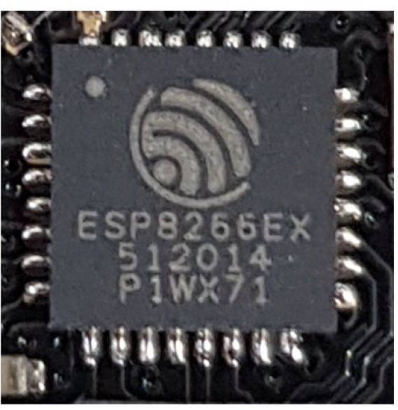
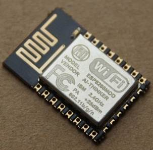
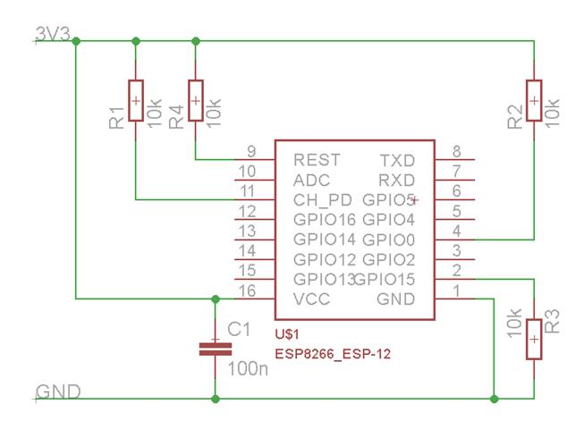
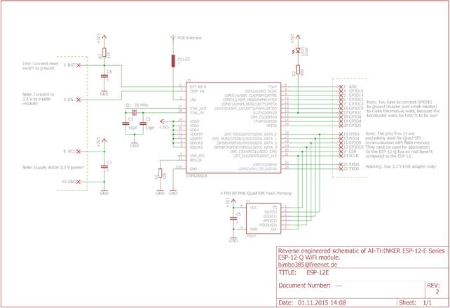

# ESP8266

Il chip  ESP8266EX è un System on Chip (SOC) prodotto da Espressif (https://www.espressif.com/en/products/socs/esp8266 ) pensato per applicazioni IoT a basso costo.

Le caratteristiche peculiari di questo prodotto, che ne hanno decretato in grande successo commerciale, sono:

\-     Basso costo

\-     Basso consumo

\-     Connettività WiFi integrata

\-     Dimensioni ridotte

Il chip ESP8266EX include un processore RISC 32 bit Tensilica L106 con frequenza di clock fino a 160Mhz, le interfacce di comunicazione digitali comunemente utilizzate e tutto quello che serve per la connessione ad una rete WiFi.

## I Moduli ESP8266

Le CPU ESP8266 vengono venute include in moduli pre-assemblati realizzati da diversi produttori di elettronica. Una lista dei più comuni si trova on line su https://www.esp8266.com/wiki/doku.php?id=esp8266-module-family#modules

I moduli hanno dimensioni di pochi centimetri e possono essere utilizzati sia su prototipi che su prodotti.

Figure 1. modulo ESP12-E

Oltre al microcontrollore, i moduli includono una serie di componenti essenziali per corretto funzionamento della CPU (MCU) e quindi ne semplificano enormemente l’utilizzo.

Ad esempio il modulo 12-E in una area di 16mm x 24mm include una memoria Flash, una antenna per WiFi,  un oscillatore, un led ed alcuni componenti passivi (resistenze e condensatori) necessari per un funzionamento stabile.

Figure 2. Configurazione hardware per utilizzo modulo ESP-12

 

 

Figure 3. Schema di un modulo ESP8266 12-E

Per funzionare I moduli ESP8266 hanno bisogno di:

\-     Essere alimentati

\-     Essere programmati

\-     Essere connessi ad input ed output

