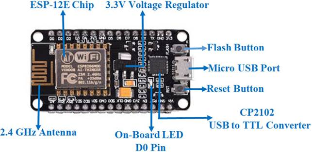
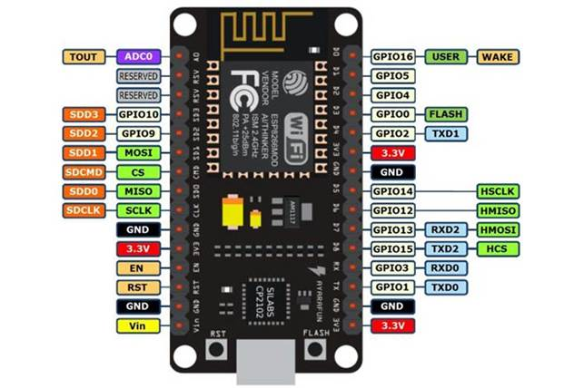
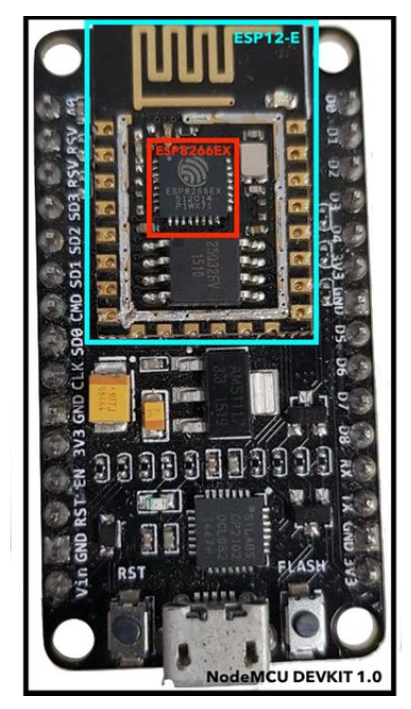
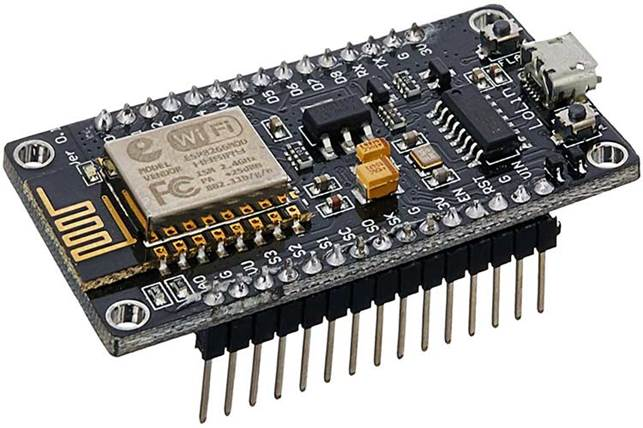

# NodeMCU

La piattaforma di sviluppo NodeMCU (http://www.nodemcu.com/) include delle schede (chiamate DevKit) con a bordo moduli ESP9266 12E (oppure 12F) programmate con un firmare dotato in un interprete del linguaggio LUA.

Per i nostri progetti utilizzeremo le schede della piattaforma NodeMCU, andando a sostituire il firmware con quello sviluppato dalla community del progetto “ESP8266 Arduino core” (https://github.com/esp8266/Arduino)

## NodeMCU DevKit

La scheda NodeMCU DevKit consiste in un modulo ESP-12E montato insieme ad una interfaccia USB-Seriale ed ad un alimentatore che permette l’alimentazione e la programmazione direttamente dalla porta USB del computer. In pratica utilizzando queste schede non sono necessari altri componenti elettronici per programmare il modulo ESP-12E.

Le schede sono inoltre dotare di pin esterni pensati per la connessione con *breadborad* e cavi *dupont* inclusi nel kit di laboratorio.

 

Figure 6. NodeMCU Board componets.

Figure 7. NodeMCU board Pinout

### Cloni NodeMCU DevKit

Il progetto hardware delle schede DevKit NodeMCU è open source e diversi produttori hanno realizzato dei cloni (più o meno) simili all’originale. Le diverse schede in commercio derivano dallo stesso progetto e dovrebbero essere tutte equivalenti dal punto di vista della programmazione. Differiscono invece in alcuni dettagli hardware come ad esempio il chip del convertitore USB-Serial, il circuito integrato dello stabilizzatore di tensione e le dimensioni della scheda stessa.

 

 

Figure 8. Esempio di clone NodeMCU DevKit commercializzato come Lolin V3

t