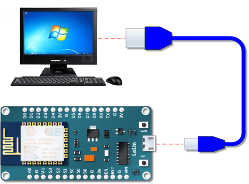
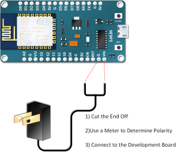
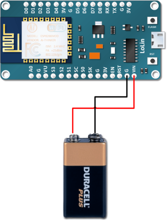

## Alimentare il modulo ESP8266

Dalle specifiche tecniche dei moduli ESP8266 è evidente che per un funzionamento stabile serve una alimentazione esterna stabilizzata a 3.3V e 500mA.  

Ad esempio per i moduli ESP-12F [esp-12f_product_specification_en.pdf (ai-thinker.com)](https://docs.ai-thinker.com/_media/esp8266/docs/esp-12f_product_specification_en.pdf)

Online si trovano diversi esempi di alimentazione realizzata con due batterie stilo da 1.5V o una batteria al litio da 3V ... potrebbe anche funzionare, ma siamo al limite delle specifiche, in particolare quando le batterie iniziano a scaricarsi.

- Per un funzionamento stabile suggerisco di usare un regolatore di tensione (es. [LD1117](https://www.st.com/resource/en/datasheet/ld1117.pdf) o simili) per avere una tensione 3.3V constante

**Nota: L’utilizzo della connessione WiFi richiede molta più corrente rispetto al normale funzionamento della sola CPU. Una alimentazione insufficiente è spesso causa di problemi di connessione**.

## Alimentare le schede di sviluppo

Le schede di sviluppo utilizzate per il corso sono dotate progettate per essere alimentate con una tensione a 5V e sono dotate di un regolatore di tensione per fornire i 3.3V richiesti dal microcontrollore. 

Per quanto riguarda l'assorbimento di corrente la specifiche tecniche indicano un assorbimento di picco di 500mA che potrebbe essere troppo elevato per la porta USB del vostro portatile. Però in pratica l'assorbimento è solitamente molto più basso e quindi nella maggior parte dei casi la porta USB è in grado di fornire una alimentazione sufficiente.

Le schede di sviluppo NodeMCU possono essere alimentate con una tensione esterna compresa tra 5 e 20V. **Questi valori dipendono dal regolatore di tensione effettivamente presente (a seconda del produttore se ne trovano diversi) e quindi devono essere verificati andando a leggere il codice del componente ed i valori di tensione riportati nel datasheet.**

Dopo aver programmato la scheda è possibile alimentarla in uno dei seguenti modi:

1. Dalla porta USB del PC
2. Utilizzare un powerbanck per smartphone e un cavo USB-Micro-USB
3. Usando un alimentatore con uscita 5V@500mA (tutti quelli degli smartphone) 
4. Utilizzare delle batterie. Alcaline, al litio o ricaricabili. Il pacco batterie deve essere in grado di produrre almeno 5V 
5. 

