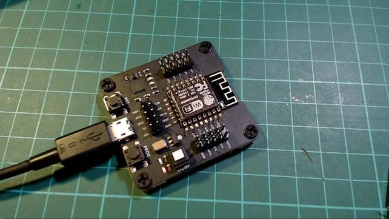
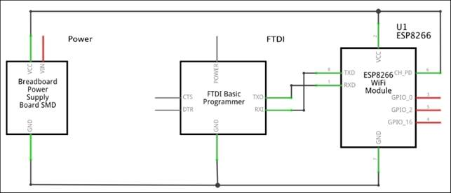
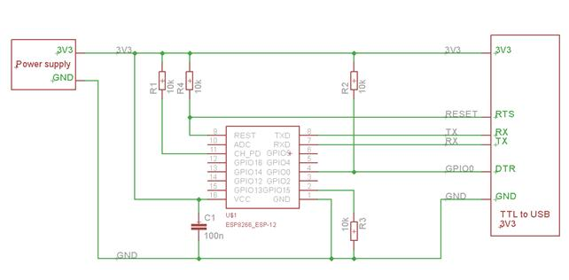
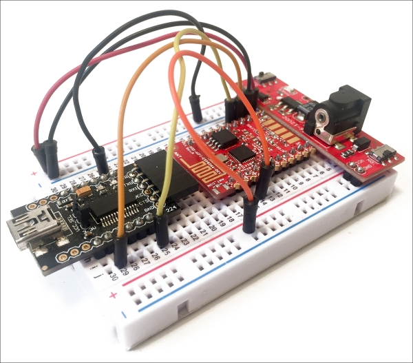

## Programmare i moduli ESP8266

### Metodo 1: usare un programmatore

Si tratta di un dispositivo hardware dedicato in cui inserire il modulo per la programmazione. Il modulo viene poi tolto e spostato nel prodotto finale.

### Metodo2: con un convertitore USR-Seriale

Questo metodo richiede l’utilizzo di alcuni componenti esterni per far funzionare il modulo in modalità programmazione” e riuscire a trasferire correttamente il programma.

Le connessioni reali variano a seconda del modulo utilizzato e del tipo di convertitore USB-seriale

 

Figure 4. Schema programmazione ESP-12

 

 

 

Figure 5. Programmazione di un modulo su breadboard