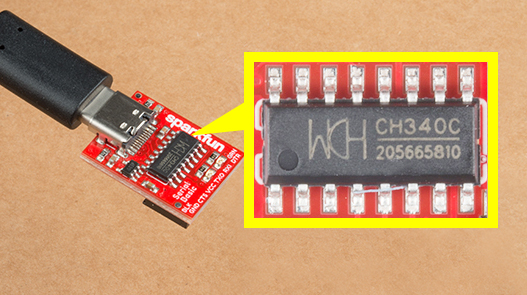
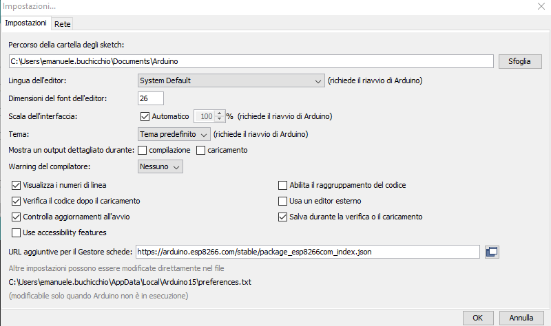
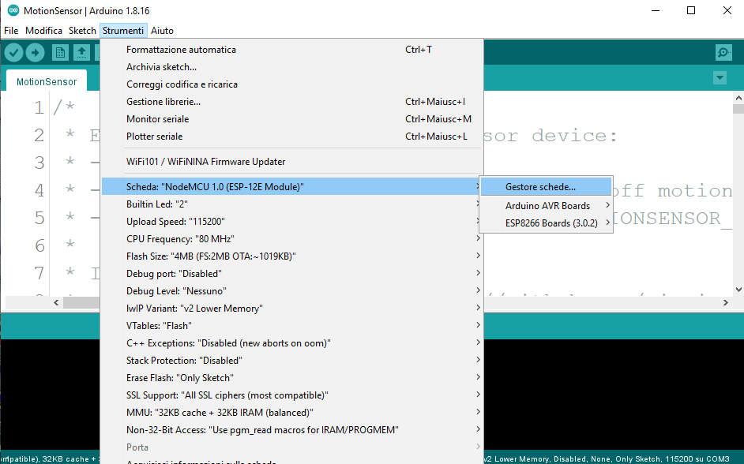
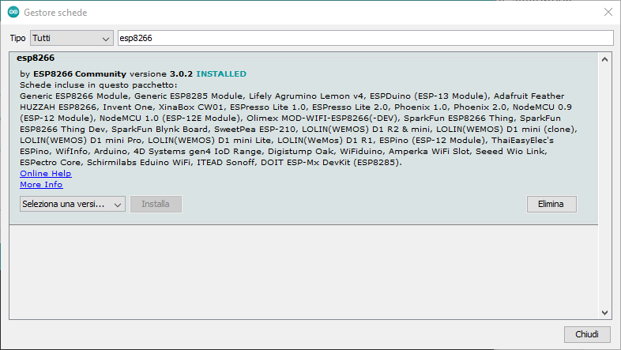
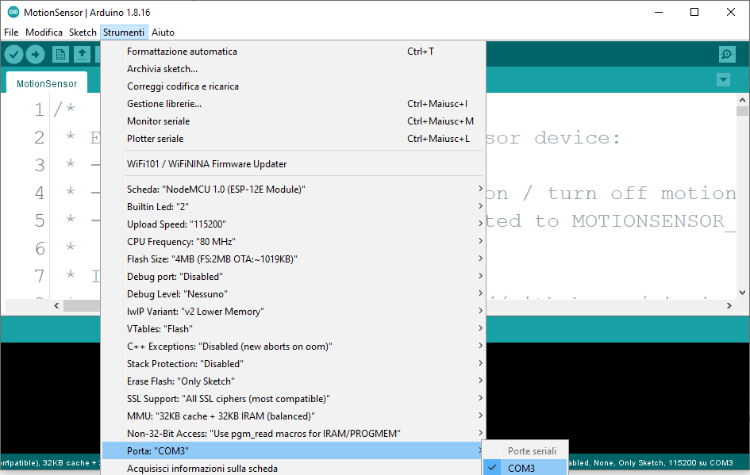
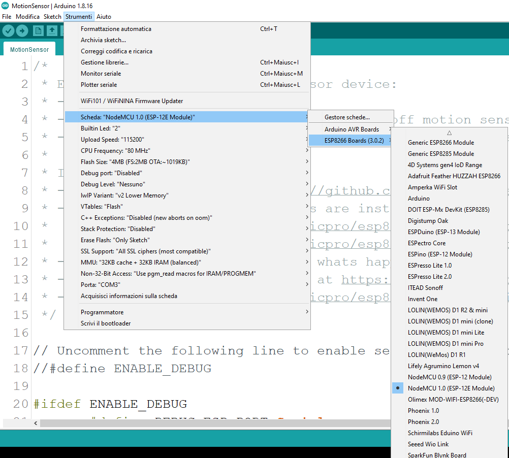
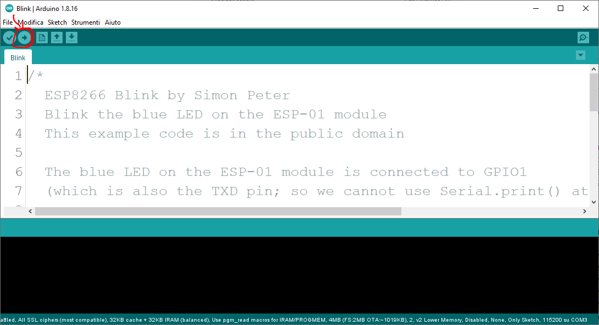
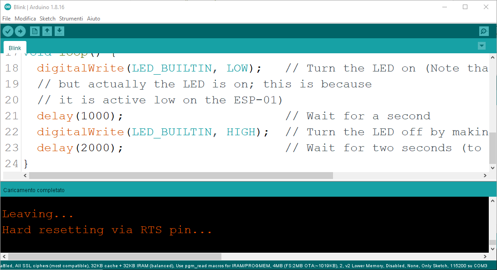

# Configurazione ambiente di sviluppo

## Step1: Installare Driver la programmazione della scheda di sviluppo

Installare driver per adattatore USB - seriale presente sulla scheda di sviluppo. Nota nel caso delle schede fornite per il corso  si tratta di un CH340

Le istruzioni per installare i driver si trovano ad esempio su <https://learn.sparkfun.com/tutorials/how-to-install-ch340-drivers/all>

1. Installare ambiente di sviluppo ESP8266 con firmware Arduino.

## Step2: Installare ambienti di sviluppo software

Le opzioni disponibili sono diverse: sia gratuite che commerciali.

 Di seguito quelle consigliate per il corso:

- Opzione1: ArduinoIDE  (consigliato per principianti senza esperienza di sviluppo C/C++)
- Opzione2: Visual StudioCode + Platformio (consigliato per sviluppatori abituati ad usare Visual Studio Code)
  - Nota: Platformio + disponibile anche in abbinamento ad editor diversi da Visual Studio Code

- Opzione3: Visual Studio + Visual Micro (consigliato per sviluppatori Visual C/C++ abituati ad usare Visual Studio )

## Arduino IDE

1. Scaricare l'ultima versione stabile di ArduinoIDE da [https://www.arduino.cc/en/software](https://www.arduino.cc/en/software)
2. Installare supporto per ESP8266 in ArduinoIDE
   - File -> "Impostazioni"
   - Inserire `https://arduino.esp8266.com/stable/package_esp8266com_index.json` 
3. Installare ESP8266 Community in Gestore Schede
   - Aprire  "Gestore Schede" in Strumenti=> Scheda => Gestore scheda
   - Cercare ESP8266 ed installare "esp8266" realizzate da "ESP8266 Community"
     - **ATTENZIONE: le versioni a partire dalla 3.0 hanno introdotto delle incompatibilità con diverse librerie che bloccano il funzionamento di molti progetti esistenti. Ad esempio gli esempi nella documentazione di Azure IoT Hub e IoT Central non compilano o non funzionano**. In caso di problemi eseguire il downgrade ad un versione precedente (es. 2.5 o 2.7)

### Visual Studio Code e Platformio

CONTRIBUISCI AL PROGETTO SCIVENDO IL CONTENUTO DI QUESTA SEZIONE

<https://www.electronicshub.org/programming-esp8266-using-vs-code-and-platformio/>

### Visual Micro

CONTRIBUISCI AL PROGETTO SCIVENDO IL CONTENUTO DI QUESTA SEZIONE

<https://www.visualmicro.com/page/User-Guide.aspx?doc=Getting-started.html>)

## Step3: Test ambiente di sviluppo

Ora è il momento di verificare il corretto funzionamento dell'ambiente di sviluppo provando ad caricare ed eseguire un semplice programma sulla scheda di sviluppo.

1. Aprire Arduino IDE
2. Dalla cartella degli esempi per ESP8266 aprire il progetto "[Blink](https://github.com/emanbuc/CorsoApplicazioni_IoT/tree/main/ESP8266/Blink)"
3. Connettere la scheda al PC
4. Selezionare la porta di comunicazione 
5. Selezionare il tipo di scheda di sviluppo (per le schede fornite durante il corso selezionare Nome MCU 1.0) 
6. Caricare il programma sul microcontrollore 
7. Attendere la fine del caricamento. Durante il caricamento il led delle scheda lampeggia velocemente.
8. Alla fine del caricamento il microcontrollore viene riavviato e il programma viene eseguito.  
9. Il led della scheda si accende, resta acceso per 1 secondo e poi si spegne. Dopo 2 secondi si accende nuovamente e prosegue in questo modo fino a quando la scheda è alimentata. [https://youtu.be/9f9czCYL8xw](https://youtu.be/9f9czCYL8xw)
