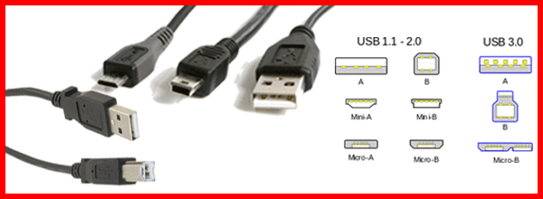
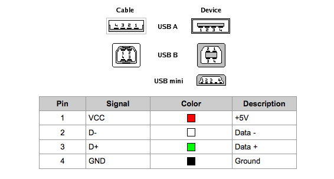

# Cavo per programmazione e debug

I criteri per la scelta del cavo da utilizzare per la programmazione del microcontrollore sono due:

1. i connettori devono essere compatibili con quelli presenti sul PC di sviluppo e sulla scheda di sviluppo
2. il cavo deve essere "completo" cioè devono essere connesse sia le lineed i alimentaizone che quelle per il trasferimento dati. I cavi per "la sola ricarica" non possono essere usati per la programmazione della scheda di sviluppo.

## Connettori USB

Le schede di sviluppo che utilizzeremo hanno un connettore USB di tipo "micro USB". Altre schede in commercio potrebbero avere connettori "mini USB" o "USB C".
I PC di sviluppo hanno porte USB di tipo A o di tipo C

## Pinout e cavi "sola ricarica"

I cavi USB hanno 4 cavi interni, due per alimentazione 5 Volt positiva e negativo e gli altri due per flusso dati bidirezionale con massa sul negativo. Nei cavi per "sola ricarica"le due linne per trasferimento dati *non sono presenti* 
È possibile verificare la continuità o la resistenza utilizzando un multimetro. Sonda tra i pin dei dati corrispondenti: da D + da un lato a D + dall'altro, oppure da D- a D-. Le linee D + / D- sono i due pin centrali di un connettore USB. Basta selezionarne uno su un lato del cavo e testare la continuità con entrambi i pin centrali sull'altro lato.

Nota sui cavi di sola ricarica: anche per la ricarica vengoo spesso utilizzati i cavi "dati" per stabilire le modalità di ricarica. Se il solo le linee di alimentazione sono connesse il dispositivo tipicamente id mette in modalità "ricarica lenta" per evitare danni.
